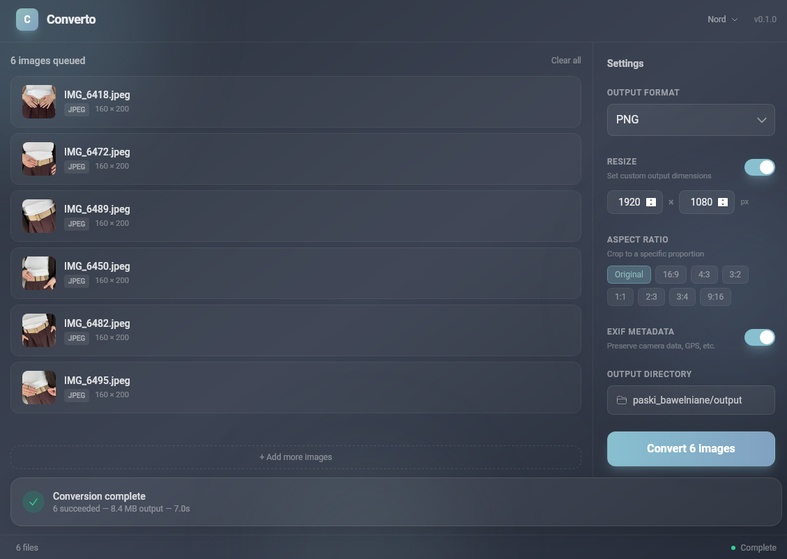

# Converto

A fast, simple image converter for people who don't want to touch the terminal.

I built this because my wife kept asking me to convert photos for her — resize something, change the format, adjust proportions. She doesn't care about `ffmpeg` flags or `imagemagick` pipelines, she just wants to drag files in and get the result. So I wrote a proper desktop app that handles it.

It's built with Rust (Tauri v2) and React, runs natively on macOS, Linux, and Windows, and is genuinely fast — not "fast for an Electron app" fast, but actual native-library fast.



## Download

Grab the latest release for your platform from the [Releases](https://github.com/escees/converto/releases) page:

| Platform | Format |
|----------|--------|
| Windows  | `.msi` / `.exe` |
| macOS    | `.dmg` |
| Linux    | `.deb` / `.AppImage` |

Or build from source (see below).

> **macOS note:** The app is not code-signed with an Apple Developer certificate, so macOS will block it on first launch. To fix this, run:
> ```bash
> xattr -cr /Applications/Converto.app
> ```
> Alternatively: open the app once (it will show a warning), then go to **System Settings → Privacy & Security** and click **Open Anyway**.

## Features

- **Drag & drop** — drop one or many files, they show up with thumbnails
- **Batch conversion** — convert dozens of images at once, processed in parallel
- **Format support** — JPEG, PNG, WebP, AVIF, HEIC/HEVC, BMP, TIFF, GIF, ICO
- **Quality control** — adjust output quality for lossy formats
- **Resize** — set target width/height
- **Aspect ratio** — crop to common ratios (16:9, 4:3, 1:1, etc.)
- **EXIF preservation** — keep or strip metadata
- **Output directory** — choose where converted files land
- **Themes** — four built-in dark themes (see below)

## Why it's fast

The `image` crate in Rust is fine for basic work, but it leaves a lot of performance on the table for common formats. Converto uses dedicated native libraries where they make a real difference:

| Format | Library | What it does |
|--------|---------|-------------|
| JPEG | [turbojpeg](https://crates.io/crates/turbojpeg) (libjpeg-turbo) | SIMD-accelerated JPEG decode/encode. 2-4x faster than pure Rust |
| WebP | [libwebp](https://crates.io/crates/webp) | Google's native WebP encoder. Supports lossy mode (the `image` crate only does lossless) |
| AVIF | [ravif](https://crates.io/crates/ravif) (rav1e) | Direct rav1e bindings with speed tuning — ~10x faster than `image` crate defaults |
| HEIC | [libheif-rs](https://crates.io/crates/libheif-rs) | Native HEIF/HEVC decode and encode |
| Everything else | [image](https://crates.io/crates/image) | PNG, BMP, TIFF, GIF, ICO — the standard Rust image library |

Batch conversions run in parallel via [rayon](https://crates.io/crates/rayon), and the encoder avoids unnecessary pixel buffer copies using zero-copy borrows when the image is already in the right color format.

## Themes

Four dark themes, switchable from the UI:

- **Aurora** — indigo/purple (default)
- **Catppuccin Mocha** — mauve/pink
- **Dracula** — purple/cyan
- **Nord** — frost blue

Implemented with CSS custom properties and a `[data-theme]` attribute, stored in Zustand so your choice persists.

## Building from source

### Prerequisites

- [Node.js](https://nodejs.org/) (18+)
- [Rust](https://rustup.rs/) (stable)
- [Tauri CLI](https://v2.tauri.app/start/prerequisites/)
- System libs for HEIC/JPEG: `cmake`, `nasm`, `libheif-dev` (or equivalent for your OS)

### Steps

```bash
git clone https://github.com/escees/converto.git
cd converto
npm install
npm run tauri dev     # development
npm run tauri build   # production build
```

The production build outputs platform-specific installers in `src-tauri/target/release/bundle/`.

## Tech stack

| Layer | Tech |
|-------|------|
| Desktop framework | [Tauri v2](https://v2.tauri.app/) |
| Backend | Rust |
| Frontend | React 18 + TypeScript |
| Styling | Tailwind CSS |
| State | Zustand |
| Build | Vite |

## License

MIT
